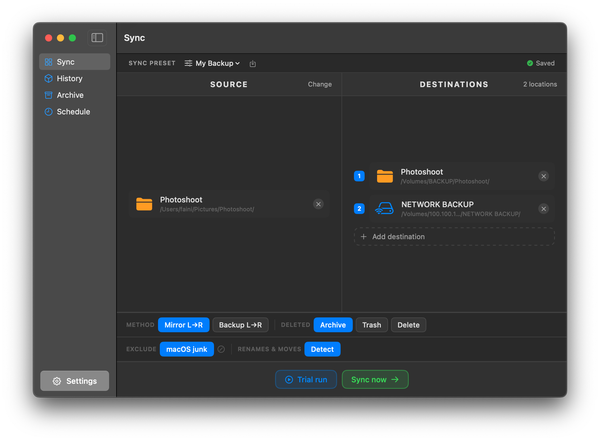
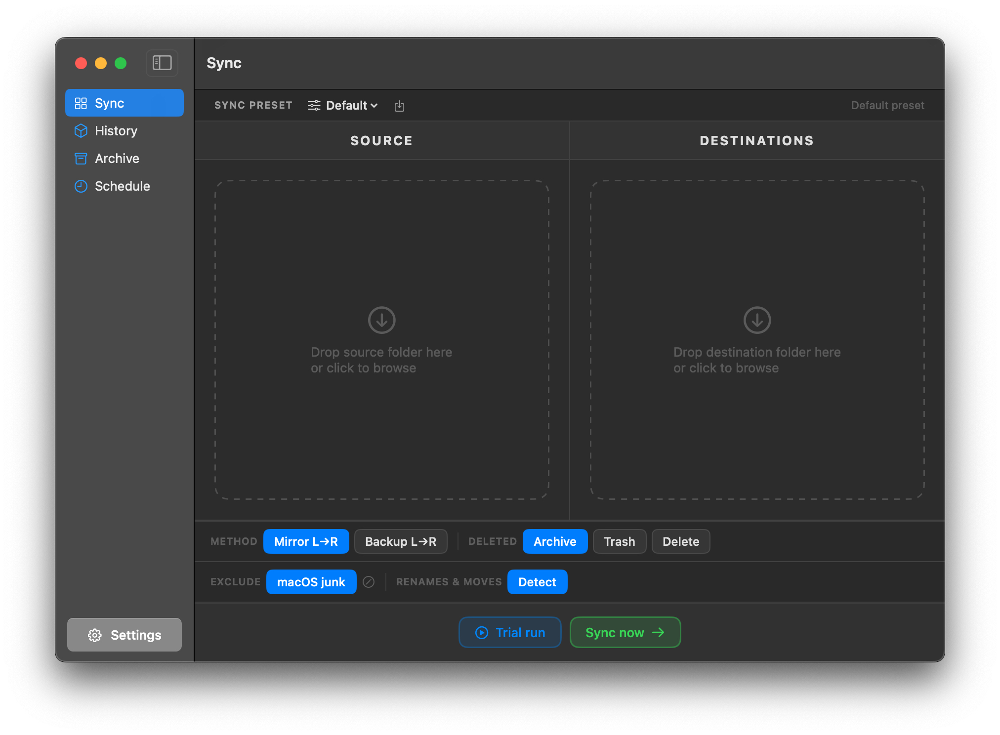
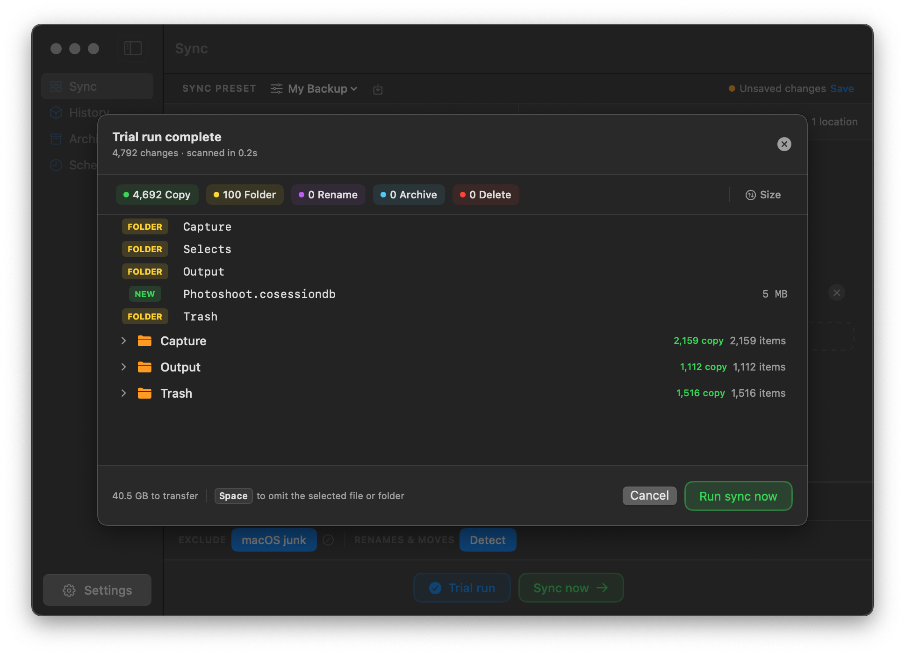
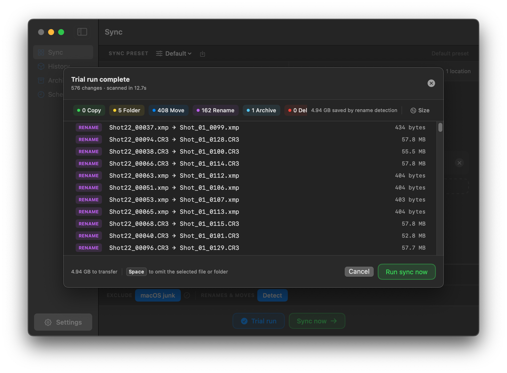
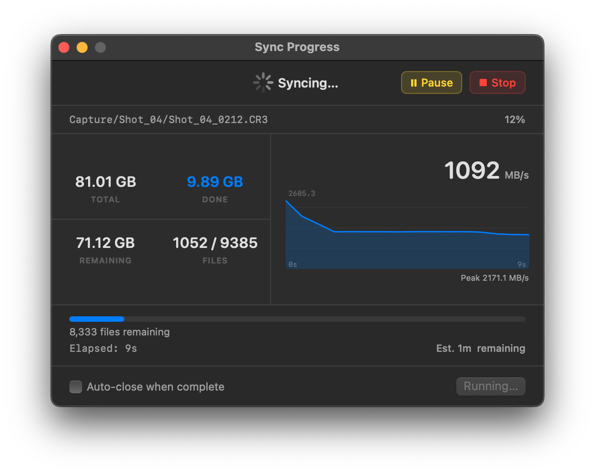
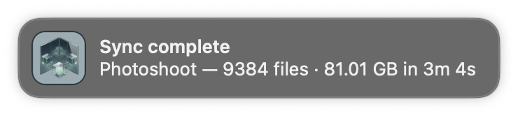
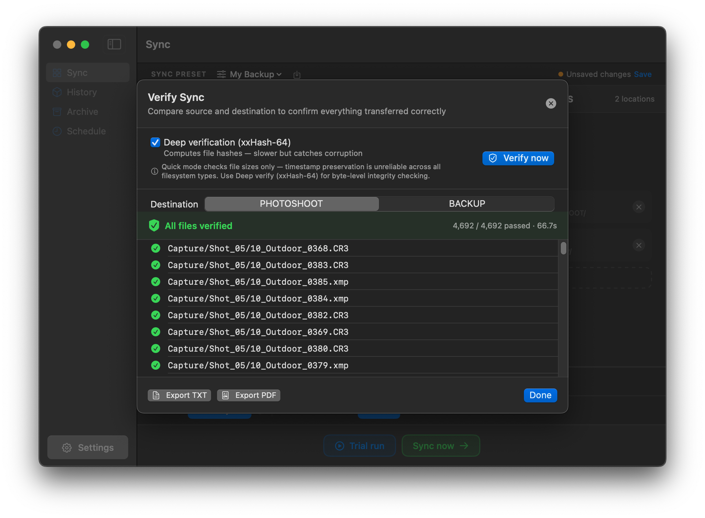
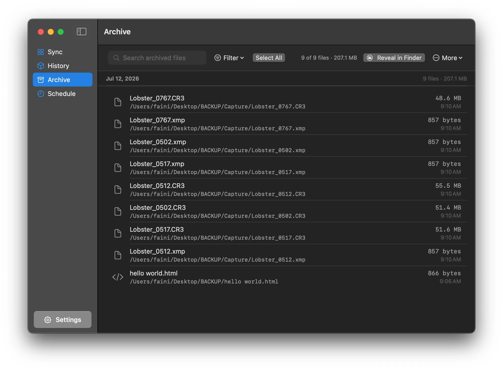
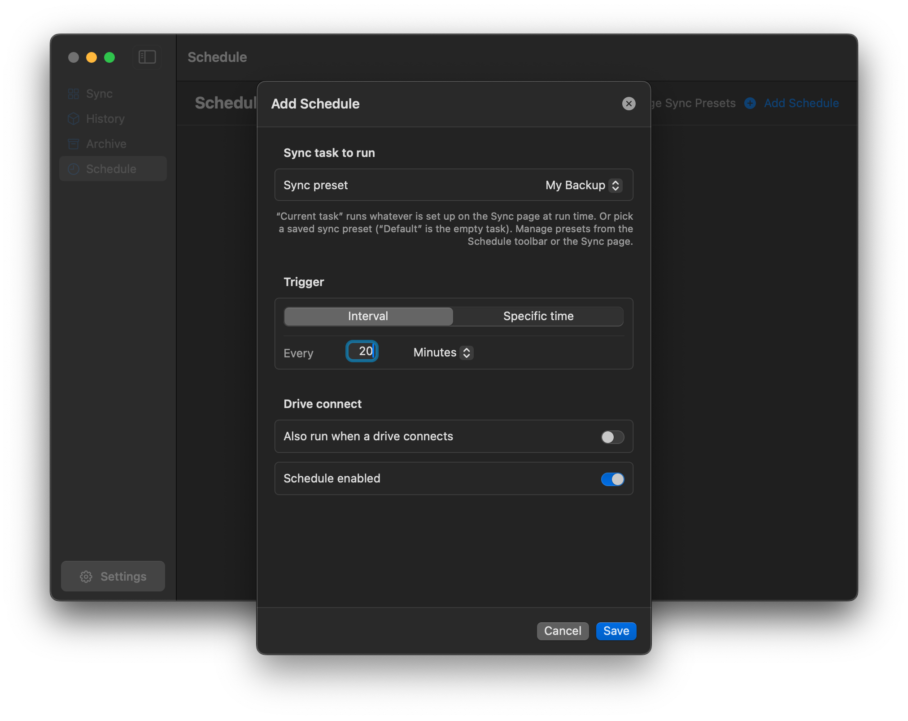
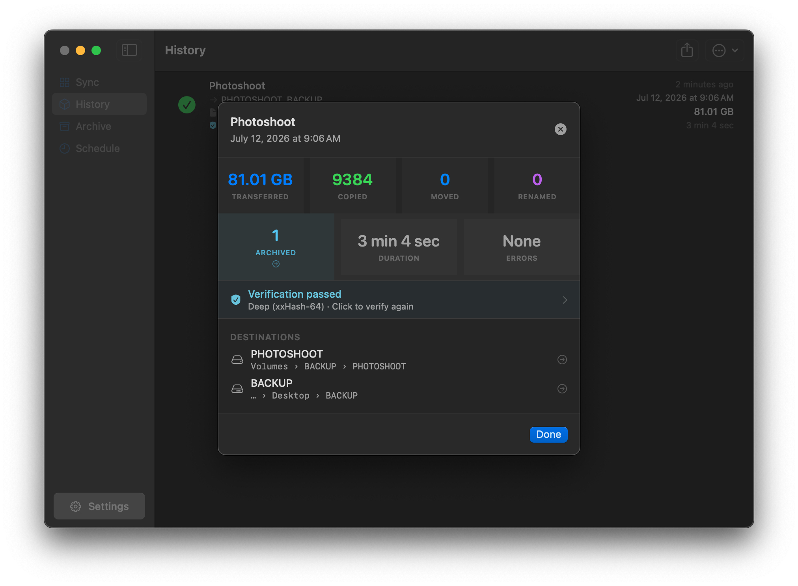

<p align="center">
  
</p>

# Mirror

**Dead-simple drag-and-drop file backup for macOS.**

Mirror keeps your files safe by syncing a source folder to one or more destinations — external drives, network volumes, or anywhere on your Mac. No complicated setup — just real-time progress and clear reporting.

<p align="center">
  
</p>

---

## Download & Install

→ **[Download the latest release](https://github.com/titleunknown/Mirror-Releases/releases/latest)**

1. Download the latest release and unzip it.
2. Drag **Mirror.app** into your **Applications** folder.
3. Open Mirror, drop a source folder on the left and a destination on the right, and you're ready to sync.

<p align="center">
  
</p>

Requires macOS 14.0 Sonoma or later (including macOS 26 Tahoe), Apple Silicon or Intel.

---

## Features

**Sync**
- Drag-and-drop source and destination folders
- Mirror (exact copy) and Backup (additive) sync modes
- Sync to multiple destinations from one source — optionally copying to two or more drives at the same time to maximize throughput
- Rename and move detection — moved or renamed files are updated in place without re-copying (renames are content-verified before the move)
- Syncs empty folders
- Resumes interrupted large file transfers from where they left off, validating the existing partial against the source before appending

**Trial run — preview before you commit**

Preview every change before a single file is touched: what will be copied, moved, renamed, archived, or removed, per destination. Omit individual files or folders from the run by selecting them and pressing Space. Stays fast and responsive even with plans of tens of thousands of changes.

<p align="center">
  
</p>

Rename detection shows exactly what it saves — renamed and moved files are matched to their new names instead of being re-copied:

<p align="center">
  
</p>

**Progress you can actually see**

Live transfer speed, files completed, data remaining, and time estimate — with pause, resume, and stop at any point.

<p align="center">
  
</p>

<p align="center">
  
</p>

**Safety**
- Atomic copies — a destination file is replaced only after its new copy is fully written and flushed, so an interrupted or failed sync never damages the previous version
- Removal safety guard — if the source scans as empty (usually an unmounted drive) or a sync would remove a large share of a destination, Mirror stops and asks before touching a single file; scheduled runs refuse automatically and notify you
- Choose how removed files are handled: Archive (recoverable in-app), Trash, or Delete
- Pre-flight check — verifies each destination is reachable and writable before sync starts
- Disk space check before syncing — warns if a destination may not have enough room
- Graceful handling of disk full and drive disconnect mid-sync, with immediate notification

**Verification**

Confirm your backup actually matches the source: Quick (size check) or Deep — a bit-for-bit integrity check optimized for fast verification of large photo and video libraries. Run it after any sync, or automatically after every sync.

<p align="center">
  
</p>

**Archive — deleted doesn't mean gone**

Files removed by a sync can be kept in a recoverable archive. Browse, search, filter, and restore them — single files or many at once, with the original folder structure preserved. When syncing to multiple destinations, browse each destination's archive separately or all together.

<p align="center">
  
</p>

**Scheduling**

Run syncs on an interval, at specific times on selected days, or automatically when a drive connects. Schedule a saved preset or the current task, with multiple independent schedules. Missed runs (Mac asleep or app closed) are caught up the next time Mirror is open.

<p align="center">
  
</p>

**History & Reporting**

Every sync is recorded: file counts, transfer sizes, duration, verification results, and any errors — categorized and exportable as plain text or PDF. Stopped syncs show the specific reason ("Drive disconnected", "Disk full", "Stopped manually"). History can auto-clear by age or count.

<p align="center">
  
</p>

**Automation**

A URL scheme works with Stream Deck, Shortcuts, Keyboard Maestro, Alfred, Raycast, and any tool that can open a URL:

```
mirror://sync?preset=Name           — run sync for a preset
mirror://sync?preset=Name&silent=1  — sync without opening the window
mirror://trial?preset=Name          — run a trial sync
mirror://stop                       — stop the current sync
mirror://status                     — copy status JSON to clipboard
mirror://open                       — bring Mirror to front
```

**Keyboard Shortcuts**

| Shortcut | Action |
| --- | --- |
| `⌘T` | Run trial sync |
| `⌘↵` | Run sync now |
| `Space` | Omit the selected file or folder (Trial run window) |
| `⌘P` | Pause / resume a running sync |
| `⌘.` | Stop a running sync |
| `⌘,` | Open settings |
| `⌘W` | Close window |

**Exclusions**
- macOS system files always excluded (.DS_Store, .Spotlight-V100, resource forks, etc.)
- Transient database journals excluded by default — temp files apps create and delete while writing to their databases (e.g. Capture One's `.cosessiondb-journal`, Lightroom's `.lrcat-wal`). They vanish mid-sync causing spurious errors, and restoring one next to a database it doesn't match can corrupt it
- Custom exclusion patterns — exact names, prefixes, or wildcards (e.g. `*.tmp`)

---

## Trial & Licensing

Mirror includes a **7-day free trial** with full functionality.

After the trial, a license is required. Purchase at **[software.fainimade.com](https://software.fainimade.com/)** — you'll receive a license key by email. To activate, open **Settings → About**, click **Enter License Key**, and paste your key.

- **One license, two Macs** — each license includes 2 seats
- **Good for life across all 1.x releases** — every 1.x update is free; a new license will be required for 2.0
- **Moving to a new Mac?** Open **Settings → About → Deactivate This Mac** to free a seat, then activate on the new machine
- Activation and deactivation need a brief internet connection; day-to-day use works fully offline

---

## Requirements

- macOS 14.0 Sonoma or later (including macOS 26 Tahoe)
- Apple Silicon or Intel Mac
- Full Disk Access recommended for complete access to all files (System Settings → Privacy & Security → Full Disk Access)

---

## Privacy

Mirror runs entirely on your Mac. Your files are never sent to any server. Sync history is stored locally on your Mac. The only network requests Mirror makes are:

- Checking for updates via the GitHub Releases API on launch (silent, no data sent)
- Activating, validating, or deactivating your license key with Lemon Squeezy (the payment provider) — only the license key and this Mac's name are sent, never your files
- Opening purchase or support links in your browser when you click them

---

## Built by

**Faini Made** — [fainimade.com](https://www.fainimade.com)

© 2026 Faini Made. All rights reserved.

---

## Support

For support or licensing questions, get in touch via [fainimade.com](https://www.fainimade.com).
